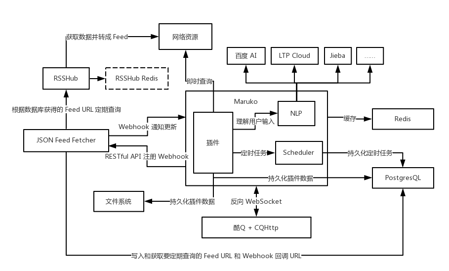

# Amadeus

Amadeus 是基于 [NoneBot](https://github.com/richardchien/none-bot) 实现的一个功能型 QQ 机器人，（即将）具有常见的查天气、查单词、翻译、教务查询、新闻订阅等功能。

名字来源于动漫《命运石之门 0》中的人工智能 Amadeus，可以通过提取人类记忆来让 Amadeus 拥有其人格、记忆等，动漫中有牧濑红莉栖和比屋定真帆两个版本。

本 repo 的 Amadeus 为一个机器人核心，实际运行中（目前）将以机器人「奶茶」作为展现。

施工中……

## 期望实现的架构

